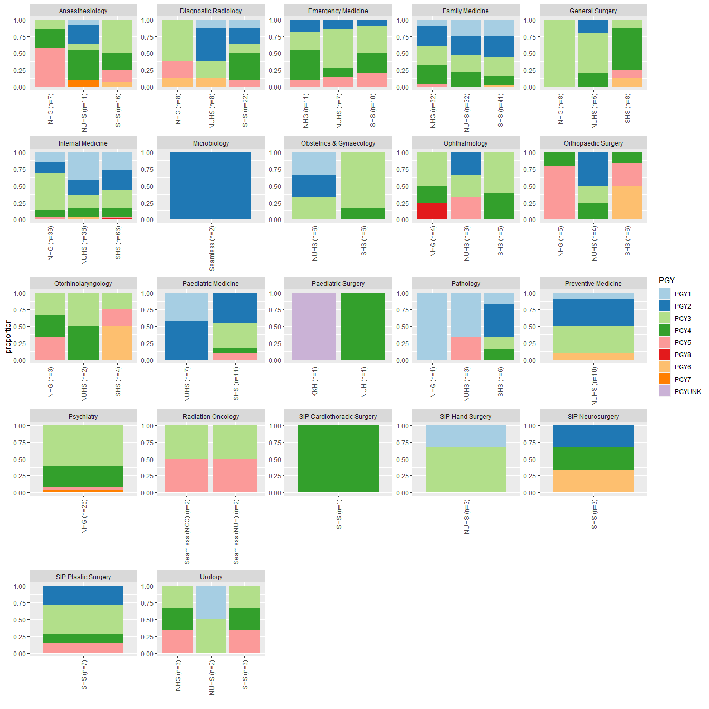
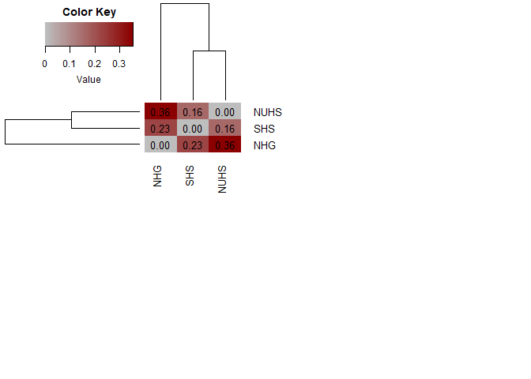

Cross cluster/residency PGY analysis in 2023
================
Joseph J Zhao

### Cross cluster/residency PGY analysis in 2023

Out of boredom, I sought to analyse the cross cluster/residency
distribution of PGY status in the latest MOH residency match.

### Load packages

``` r
package.name=c(
  "readxl", "stringi", "stringr", "RColorBrewer", "vegan", "readr", "dplyr", "reshape", "ggplot2", "gplots"
)

for (package.name in package.name){
  tryCatch(
  {
  if (!require(package.name, character.only = TRUE)){ 
    install.packages(package.name, character.only = TRUE) 
    library(package.name, character.only = TRUE)} else {library(package.name, character.only = TRUE)}
  }, 
    error=function(e){cat("ERROR :",conditionMessage(e), "\n")})
}
```

### Set working directory

``` r
wd="C:/Users/jzhao/OneDrive/Personal/random/juniorresidency_2023/"
setwd(wd)
```

### Load data

The residency match results were made available publicly on the MOHH
website:
<https://www.physician.mohh.com.sg/Documents/July%202023%20Junior%20Residency%20Intake.pdf>

``` r
df=read_csv("juniorresidency_2023.csv")
colnames(df)=c("mcr", "name", "match")
```

### Extract additional variables with regular expression

``` r
df$cluster=str_extract(df$match, "(?<=- ).*")
df$residency=str_extract(df$match, ".*(?= -)")

# Use MCR number to impute PGY status (unfortunately, I do no have a smarter way)
df$pgy=paste0("PGY", ifelse(grepl("MP", df$mcr), 1, 69-as.numeric(str_extract(df$mcr, "[:digit:]{2}"))))

# Oddly we have an outlier!
table(df$pgy)
```

    ## 
    ##  PGY1  PGY2  PGY3  PGY4  PGY5 PGY52  PGY6  PGY7  PGY8 
    ##    78   109   171    99    36     1    13     2     2

``` r
subset(df, grepl("52", df$pgy))
```

    ## # A tibble: 1 x 6
    ##   mcr     name      match                    cluster residency          pgy  
    ##   <chr>   <chr>     <chr>                    <chr>   <chr>              <chr>
    ## 1 M17376B Ho Kok On Paediatric Surgery - KKH KKH     Paediatric Surgery PGY52

``` r
# Dr Ho is probably not a PGY52, so for now we will label him as unknown - "UNK"
df$pgy=str_replace(df$pgy, "52", "UNK")
```

### Compute proportions of PGY status across cluster/residency

``` r
# prepare proportions in wideform 
out=NULL

for (i.residency in unique(df$residency)){
  for (i.cluster in unique(df$cluster)){
    
    df_temp=subset(df, df$residency==i.residency & df$cluster==i.cluster)
    if(nrow(df_temp)==0){next()}
    out=bind_rows(out, c(residency=i.residency, cluster=i.cluster, n=nrow(df_temp), prop.table(table(df_temp$pgy))))
    
  }
}

out=data.frame(out)
out[,-c(1:2)]=apply(out[,-c(1:2)], 2, as.numeric)
out[is.na(out)]=0

# create label to include n
out$label=paste0(out$cluster, " (n=", out$n, ")")

# convert dataframe into long form
df_stack=subset(melt(out), !melt(out)$variable=="n")
```

    ## Using residency, cluster, label as id variables
    ## Using residency, cluster, label as id variables

``` r
head(df_stack)
```

    ##             residency cluster       label variable     value
    ## 49  Internal Medicine     SHS  SHS (n=66)     PGY1 0.2727273
    ## 50  Internal Medicine     NHG  NHG (n=39)     PGY1 0.1538462
    ## 51  Internal Medicine    NUHS NUHS (n=38)     PGY1 0.4210526
    ## 52         Psychiatry     NHG  NHG (n=26)     PGY1 0.0000000
    ## 53 Emergency Medicine     SHS  SHS (n=10)     PGY1 0.0000000
    ## 54 Emergency Medicine     NHG  NHG (n=11)     PGY1 0.0000000

### Plot stacked barcharts

``` r
ggplot(df_stack, aes(x = label, y=value, fill=variable)) + 
        geom_bar(stat="identity") +
        facet_wrap(~ residency, scales = "free") +
        labs(x="", y="proportion", fill="PGY") +
        theme(axis.text.x = element_text(angle = 90, vjust = 0.5, hjust=1))+
        scale_fill_manual(values=brewer.pal(unique(df$pgy), "Paired"))
```

    ## Warning in if (n < 3) {: the condition has length > 1 and only the first
    ## element will be used

    ## Warning in if (n > maxcolors[which(name == namelist)]) {: the condition has
    ## length > 1 and only the first element will be used

    ## Warning in brewer.pal(unique(df$pgy), "Paired"): n too large, allowed maximum for palette Paired is 12
    ## Returning the palette you asked for with that many colors

<!-- -->

### Compute Bray-Curtis dissimilarity index

Grossly, we appreciate that the NUHS cluster matched more PGY1-2
applicants. Lets characterize the cross cluster discrepancy with a
dissimilarity index.

``` r
out=NULL
for (i.cluster in unique(df$cluster)){
    
  df_temp=subset(df, df$cluster==i.cluster)
  if(nrow(df_temp)==0){next()}
  out=bind_rows(out, c(cluster=i.cluster, prop.table(table(df_temp$pgy))))
    
}

# Data preparation and cleaning
out=data.frame(out)
rownames(out)=out$cluster
out$cluster=NULL
out[,c(1:ncol(out))]=apply(out[,c(1:ncol(out))], 2, as.numeric)
out[is.na(out)]=0

# Lets suppose we are only interested in the top 3 clusters
df_di=out[1:3, -ncol(out)]

# Compute dissimilarity index
di_mat=vegdist(df_di, method="bray", diag=T)  %>% as.matrix

heatmap.2(as.matrix(di_mat), margins=c(18,23),
            cellnote=format(round(di_mat,2), nsmall=2),
            notecex=1.0,
            notecol="black",
            cexRow = 1,
            density.info=c("none"),
            cexCol = 1,
            col=colorRampPalette(c(rep("grey", 1), rep("red4", 1)))(n = 50),
            na.color=par("bg"),
            trace="none")
```

<!-- -->

Abbreviations: PGY, post graduate year
